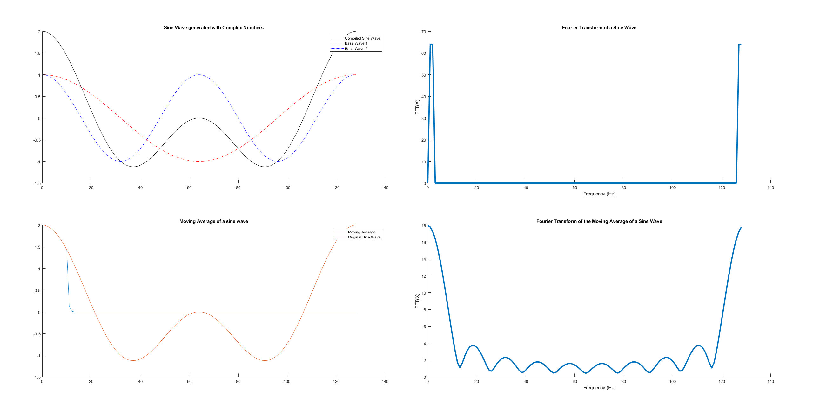
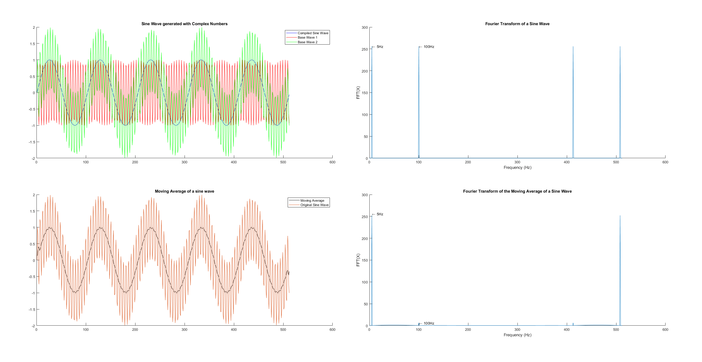

# Frequency Analysis

## Goal

Using the program from **Sine Wave Generation** and the filter from **Moving Average Filter**, generate a compound sine wave, filter the wave then apply Fast-Fourier to both the filtered and unfiltered signals.

After creating sine waves with `2 * M_PI * 64` & `2 * M_PI * 128`, in `64output` and `128output` respectively

## Rework with Gerard

After seeing the wierd spike at X=2 and X=3, I contacted Gerard, as it didn't seem right.
After looking it over, my initial analysis was right, but due to the close frequencies, the graph was hard to analyse.

We took a few minutes to generate new sine waves in MATLAB, with the following properties:

| Property | Value | Explained |
| -------- | ----- | --------- |
| Fs | 512 | Signals per second |
| T | 1/512 | Time per signal |
| L | 512 | Total nunber of samples in the array |
| n | 0:1:512-1 | The index values for the plot to look at |
| sinF1 | 5Hz | A 5Hz sine wave |
| sinF2 | 100Hz | A 100Hz sine wave |
| sinF3 | ??? | The compound wave of sinF1 and sinF2 |

After reapplying the fourier transform, and discovering the `movmean` filter, a far more distinct graph was formed:

I did recommend Gerard changing the assignment for generating 5Hz and 100Hz, as this is far clearer than 2Hz and 3Hz.
