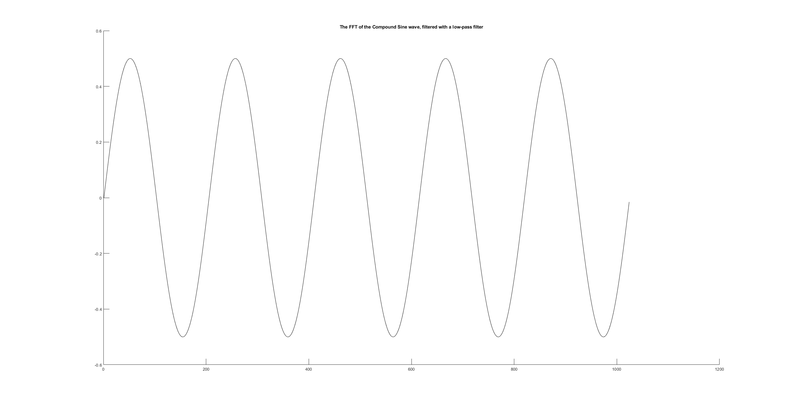
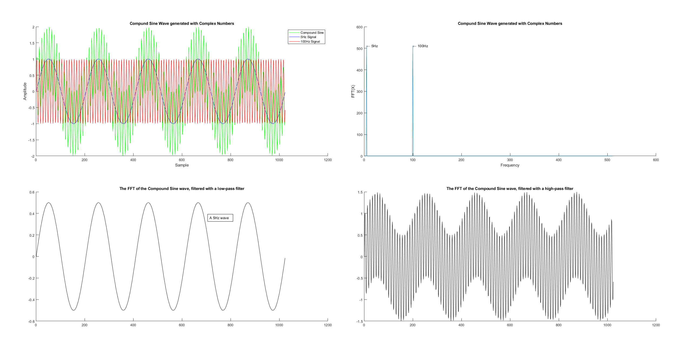

# Frequency Domain

## Goal

Filter a signal in the frequency domain, after apply Fast-Fourier Transform.

## The Method

After applying the same MATLAB code as the previous assignment to generate a sine wave, as well as generating a Fast-Fourier transform of said wave, I was looking at methods of filtering the wave for the desired frequencies. After analysing the data, I found that only the frequencies mentioned as had a value, and the others were `-0 + -0i`. This meant that I could simply set the frequencies I dont need to `complex(0,0)`, meaning there is no signal on that frequency.

Applying this basic low-pass filter (removing anyting past the cutoff point of `fLow`):

```matlab
sinF3FFT(1, fLow:end) = complex(0,0);
sinF3IFFT = real(ifft(sinF3FFT)); % Remove imaginary part
```

Which in turn resulted in the following graph:



After seeing this success, I decided to apply the same logic for creating a high-pass filter, changing the code to:

```matlab
sinF3FFT = fft(sinF3); % Reset after previous
sinF3FFT(1, 1:fHigh) = complex(0,0);
sinF3IFFT = real(ifft(sinF3FFT)); % Remove imaginary part
```

Thus removing anything **below** `fHigh`, which was set to 75 (Hz).

## End Result


