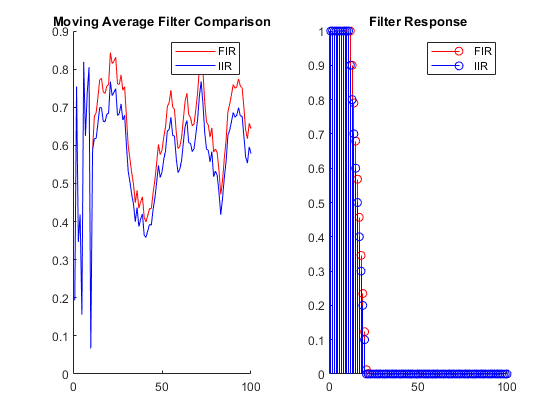
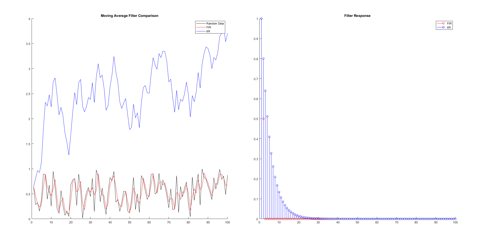

# Moving Average Filter & Impulse Response

## Goal

Implement a moving average filter, as well as an exponential decay filter with a 0.1 coefficient.

## Display

From `FIRMovingAverage.m`:

```matlab
function y1 = FIRMovingAverage(y1, arr)
    for ind = 1:1:100
        if (ind == 1)
            y1 = arr;
        else
        y1(1,ind) = 0.5 * arr(1,ind) + 0.5 * arr(1,ind-1);
        end
    end
end
```

From `IIRMovingAverage.m`, which is the expontial decay.

```matlab
function y2 = IIRMovingAverage(y2, arr)
    for ind = 1:1:100
        if(ind == 1)
            y2(1,ind) = arr(ind);
        else
            y2(1,ind) = arr(ind) + 0.1 * y2(ind - 1);
        end
    end
end
```

The first graph showcases a random dataset between 0-1 with a length of 100, whereas the second graph is an impulse.



And for some clarity, as the requested decay rate of 0.1 is rather aggressive, the value for the IIR filter was changed to 0.8. This does however cause the exponential decay algorithm to spiral out of control, as the additive nature (only 0.8) of the coefficient causes the buffer values to eternally increase. For that reason, values below 0.5 should be used when filtering.



## Addendum

As it turns out, MATLAB has a `movmean` function, which acts as a moving average filter.
`movmean(X,Y)` results in a function with input X, and a filtersize of Y.
